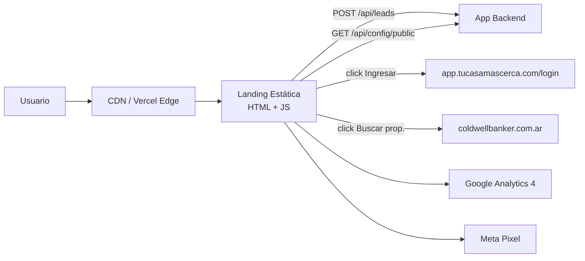
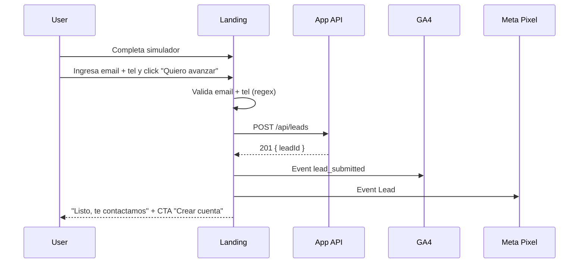

# TCMC · Especificación Técnica y Funcional — WEB (Landing Pública)

**Producto:** Tu Casa +Cerca — Plataforma fintech de micro-hipotecas en USD
**Componente:** Sitio web público (landing + simulador + captación de leads)
**Versión del documento:** 3.0 — Mayo 2026
**Audiencia:** Equipo de desarrollo Frontend / Web
**Estado del prototipo:** Funcional, disponible en `/prototype/landing/index.html`

---

## 1. Resumen Ejecutivo

### 1.1 Qué es TCMC

Tu Casa +Cerca es una plataforma fintech argentina que conecta compradores de **primera vivienda** con financiamiento estructurado vía Fondo Común de Inversión Cerrado (FCICC), operando inicialmente a través de la red de **Coldwell Banker Argentina**.

### 1.2 Qué entrega este componente (WEB)

El sitio público es la **puerta de entrada comercial** al producto. Su único objetivo es:

1. **Educar** al visitante sobre la propuesta de valor.
2. **Convencer** mediante simulación interactiva, testimonios y casos de uso.
3. **Convertir** mediante CTA al simulador y al onboarding de la app.
4. **Capturar leads** con simulación + email/teléfono.

**No es transaccional.** No procesa solicitudes ni guarda data sensible. La gestión real del crédito ocurre en la app (ver `02-TCMC-Spec-APP.md`).

### 1.3 Stack recomendado para producción

| Opción | Stack | Esfuerzo | Cuándo elegirla |
|--------|-------|----------|-----------------|
| **A — Recomendada** | HTML + CSS + JS vanilla deployado en Vercel/Netlify estático | ~25 hs | Lanzamiento rápido. Mantenemos el prototipo casi tal cual. |
| **B — Profesional** | Next.js 14 (App Router) + Tailwind + TS | +15 hs | SEO premium, blog futuro, CMS headless, A/B testing. |

Recomendamos **Opción A para MVP** y migrar a Opción B cuando el volumen de tráfico justifique el SSR. El prototipo está construido en HTML+CSS+JS vanilla pensado para portarse a cualquiera de las dos sin reescrituras.

### 1.4 Alcance MVP vs fases futuras

| Funcionalidad | MVP | Fase 2 | Fase 3 |
|---------------|-----|--------|--------|
| Landing responsive con simulador | ✅ | | |
| Captura de leads (POST /api/leads) | ✅ | | |
| Tasas dinámicas desde backend | ✅ | | |
| Botón "Ver propiedades en CB" con flag suitable_for_credit | ✅ | | |
| Analytics GA4 + Meta Pixel | ✅ | | |
| SEO básico + sitemap | ✅ | | |
| Blog/CMS headless (Sanity, Contentful) | | ✅ | |
| Calculadora avanzada (escenarios) | | ✅ | |
| A/B testing (Vercel/Optimizely) | | ✅ | |
| Chat en vivo / WhatsApp Business | | | ✅ |
| Multi-idioma (ES/EN) | | | ✅ |

---

## 2. Arquitectura

### 2.1 Diagrama de alto nivel



### 2.2 Componentes

| Componente | Responsabilidad |
|------------|----------------|
| CDN / Edge | Servir HTML estático, imágenes optimizadas (WebP), caché agresivo |
| Landing | Render del HTML + ejecución del simulador en cliente |
| Integraciones externas | API pública del backend de la app + Coldwell Banker |
| Tracking | GA4, Meta Pixel, opcional Hotjar |

### 2.3 Dominios y ambientes

| Ambiente | Dominio | Notas |
|----------|---------|-------|
| Producción | `https://tucasamascerca.com` | SSL automático |
| Staging | `https://staging.tucasamascerca.com` | Acceso protegido por basic auth |
| Local | `http://localhost:8080` | `python3 -m http.server` o `npx serve` |

---

## 3. Mapa de Secciones de la Landing

Todas las secciones ya están maquetadas en el prototipo (`/prototype/landing/index.html`). El dev solo debe portarlas y optimizarlas.

| # | Sección | Contenido | Conversión esperada |
|---|---------|-----------|---------------------|
| 1 | Header | Logo + nav + botón "Ingresar" | Click "Ingresar" |
| 2 | Hero + Simulador | Título, badges, simulador funcional, CTA principal | Uso del simulador, click "Comenzar" |
| 3 | Cómo funciona | 4 pasos con iconos | Lectura (señal de interés) |
| 4 | Casos de uso | 6 tarjetas: enamoraste / familia / avanzar / remodelar / sin deudas / zona | Click en caso (segmentación) |
| 5 | Coldwell Banker | Buscador con filtros que redirige a CB con `suitable_for_credit=1` | Click "Ver propiedades" |
| 6 | Testimonios | 3 testimonios con foto + nombre + ciudad | Social proof |
| 7 | FAQ | Acordeón con 8-10 preguntas frecuentes | Reducción de fricción |
| 8 | CTA final | Captura de email + teléfono → lead | **Conversión principal** |
| 9 | Footer | Links legales, contacto, redes | Click contacto |

---

## 4. Simulador (Core funcional de la landing)

### 4.1 Inputs del usuario

| Campo | Tipo | Min / Max | Default | Notas |
|-------|------|-----------|---------|-------|
| Valor de la propiedad (USD) | number / slider | 50.000 / 200.000 | 100.000 | Step 1.000 |
| Monto del crédito (USD) | number / slider | 5.000 / 50.000 | 30.000 | Limitado por LTV máx |
| Plazo (meses) | select | 12 / 24 / 36 / 48 / 60 | 36 | Discreto |

### 4.2 Outputs en tiempo real

| Output | Fórmula | Formato |
|--------|---------|---------|
| Cuota mensual estimada | PMT(tasa, plazo, monto bruto) | USD con 2 decimales |
| Monto bruto a financiar | préstamo + 5% upfront + 21% IVA sobre upfront | USD |
| Tasa Nominal Anual (TNA) | Lookup en config por plazo | % |
| Costo implícito anualizado | (1 + (cuota·meses)/préstamo − 1)^(12/meses) − 1 | % |
| LTV efectivo | préstamo / valor propiedad | % con alerta si > 35% |

### 4.3 Algoritmos (fuente única en `/shared/algorithms.js`)

```javascript
// Monto bruto = préstamo + gastos upfront (5%) + IVA sobre gastos (21%)
function calcularBruto(prestamo) {
  const upfront = prestamo * 0.05;
  const iva = upfront * 0.21;
  return prestamo + upfront + iva;
}

// Cuota mensual: fórmula PMT estándar (sistema francés)
function calcularCuota(tasaAnual, meses, bruto) {
  const tm = tasaAnual / 12;
  return bruto * (tm * Math.pow(1 + tm, meses)) / (Math.pow(1 + tm, meses) - 1);
}

// TNA aproximada anualizada compuesta
function calcularTNA(cuotaMensual, meses, prestamo) {
  const td = (cuotaMensual * meses) / prestamo - 1;
  return Math.pow(1 + td, 12 / meses) - 1;
}

// Máximo permitido dado valor de propiedad y config
function maxAllowedLoan(propertyValue, config) {
  const byLTV = Math.floor(propertyValue * config.maxLTV);
  return Math.min(config.maxLoan, byLTV);
}
```

**Regla de oro:** No duplicar estos algoritmos en el código de la landing. Importar siempre desde `/shared/algorithms.js`. Si en algún momento se necesita modificar un cálculo, debe coordinarse con el equipo de la app (ambos consumen el mismo archivo).

### 4.4 Configuración consumida desde backend

```javascript
// Al cargar la landing, en background:
fetch(`${APP_URL}/api/config/public`)
  .then(r => r.json())
  .then(cfg => {
    localStorage.setItem('tcmc_config', JSON.stringify({ ...cfg, fetchedAt: Date.now() }));
    refreshSimulator(cfg);
  })
  .catch(() => useFallback(CONFIG_DEFAULTS));

// Cache válido por 5 minutos; si falla, usar CONFIG_DEFAULTS hardcodeado
```

**Estructura de la respuesta** (definida en `/shared/CONTRACT.md`):

```json
{
  "tasasBase": { "12": 0.105, "24": 0.115, "36": 0.125, "48": 0.135, "60": 0.145 },
  "maxLTV": 0.35,
  "maxLoan": 50000,
  "version": 3,
  "updatedAt": "2026-04-20T10:00:00Z"
}
```

**Resiliencia:** Si la API falla o tarda > 1 segundo, el simulador funciona con `CONFIG_DEFAULTS` (hardcodeado). **Nunca** romper la landing por falta de conexión al backend.

---

## 5. Integración con la App

Toda la integración con la app está formalizada en `/shared/CONTRACT.md` (versión 1.0, 2026-04-20). Los tres puntos de contacto son:

### 5.1 Handoff "Ingresar" → app

Al hacer click en el botón "Ingresar":

```javascript
const APP_URL = window.APP_URL || 'https://app.tucasamascerca.com';
const params = currentQuote
  ? `?propertyValue=${propertyValue}&loanAmount=${loanAmount}&months=${months}`
  : '';
window.location.href = `${APP_URL}/login${params}`;
```

La app lee los query params en `/login` y los guarda en `sessionStorage` para prellenar el wizard luego de que el usuario registre la cuenta.

### 5.2 Captura de lead (POST /api/leads)

```http
POST https://app.tucasamascerca.com/api/leads
Content-Type: application/json

{
  "email": "usuario@email.com",
  "phone": "+54 9 11 1234-5678",
  "quote": {
    "propertyValue": 150000,
    "loanAmount": 45000,
    "months": 36,
    "cuota": 1234.56,
    "tna": 0.125,
    "bruto": 47625
  },
  "source": "landing_simulator",
  "utm": { "source": "google", "medium": "cpc", "campaign": "..." }
}
```

**Respuestas:**
- `201 Created` → `{ "leadId": "lead_xxx" }`
- `400 Bad Request` → email faltante o quote malformado
- `429 Too Many Requests` → rate limit (5 leads/min por IP)

### 5.3 Config pública (GET /api/config/public)

Ya documentado en sección 4.4.

### 5.4 CORS requerido en el backend

El backend de la app debe permitir CORS para los dos endpoints públicos desde:

```
https://tucasamascerca.com
https://staging.tucasamascerca.com
http://localhost:3000
http://localhost:8080
```

---

## 6. Integración con Coldwell Banker

### 6.1 Buscador embebido en la sección CB

```javascript
function buscarEnCB() {
  const zona = document.getElementById('cb-zona').value;
  const tipo = document.getElementById('cb-tipo').value;
  const precio = document.getElementById('cb-precio').value;

  let url = 'https://www.coldwellbanker.com.ar/propiedades?';
  const params = ['suitable_for_credit=1'];      // siempre presente
  if (zona)   params.push('zona='   + encodeURIComponent(zona));
  if (tipo)   params.push('tipo='   + encodeURIComponent(tipo));
  if (precio) params.push('precio_hasta=' + encodeURIComponent(precio));

  url += params.join('&');
  window.open(url, '_blank', 'noopener');
}
```

### 6.2 Sobre el flag `suitable_for_credit=1`

Convención **bilateral** entre TCMC y Coldwell Banker:
- TCMC siempre envía el flag en la URL de búsqueda.
- CB debe implementar el filtro en su backend para devolver únicamente propiedades aptas.

**Criterios de aptitud (a confirmar con CB):**
- Valor ≤ USD 142.857 (umbral derivado de LTV 35% + monto máx USD 50.000)
- Situación dominial saneada
- Apta hipoteca
- Ubicada en zonas cubiertas por el FCICC

**Estado actual:** Pendiente confirmación con CB. Si al momento del launch CB no tiene implementado el filtro, la búsqueda funciona igual (devuelve todas las propiedades) y el flag se ignora.

---

## 7. Branding (alineado al Brandbook V2)

> Fuente de verdad: `/TCNCERCA-BRANDBOOK-V2.pdf`. Leerlo antes de tocar estilos.

### 7.1 Naming y copy

- **Nombre oficial:** "Tu Casa +Cerca" (nunca solo "+Cerca")
- **Tagline:** "Tu casa está +Cerca de lo que creés"
- **Tono:** profesional fintech, cálido pero institucional, evitar lo infantil

### 7.2 Paleta (CSS variables)

```css
--brand-primary: #1A4394;   /* Azul institucional — botones, gradientes, headers */
--brand-vivid:   #0D00FF;   /* Azul vibrante — focus, hover, links */
--brand-dark:    #1E1E1E;   /* Negro/gris — texto principal */
--brand-mid:     #748082;   /* Gris medio — texto secundario */
--brand-light:   #E1EAEB;   /* Gris claro — bordes, fondos suaves */
--brand-white:   #FFFFFF;
```

Versiones de opacidad (75/50/25/10%) están en el brandbook.

### 7.3 Tipografía — Poppins (Google Fonts)

Pesos disponibles: 300 / 400 / 500 / 600 / 700. **Prohibido usar 800**.

| Uso | Peso | Tamaño |
|-----|------|--------|
| H1 hero | 700 | clamp(32px, 5vw, 48px) |
| H2 sections | 600 | clamp(24px, 4vw, 36px) |
| H3 cards | 600 | 18–20px |
| Body | 400 | 15–16px |
| Body small / hints | 300 | 13–14px |
| Botones | 600 | 14–15px |
| Eyebrows / labels | 500, uppercase, tracking | 11–12px |

### 7.4 Iconografía

- **Set:** Lucide Icons inline (SVG line-style)
- **Reglas:** stroke-width 2, stroke-linecap round, stroke-linejoin round, color `currentColor`
- **Tamaños:** 18 / 24 / 32 / 48 px
- **No usar emojis** en componentes principales

### 7.5 Logo

- **Mínimo:** 70px web / 1,85 cm impreso
- **Sobre azul institucional:** logo en blanco
- **Sobre fondos claros:** logo en color o azul
- **9 prohibiciones del brandbook** (no condensar, no recolorear, no quitar elementos del isotipo, no submarcas)

### 7.6 Sombras y spacing

```css
--shadow-sm: 0 2px 8px  rgba(26, 67, 148, 0.08);
--shadow-md: 0 8px 24px rgba(26, 67, 148, 0.12);
--shadow-lg: 0 20px 48px rgba(26, 67, 148, 0.18);

--space-1: 8px;  --space-2: 16px; --space-3: 24px;
--space-4: 32px; --space-6: 48px; --space-8: 64px; --space-12: 96px;
--section-py: clamp(48px, 8vw, 80px);
--section-px: clamp(16px, 4vw, 24px);
```

### 7.7 Breakpoints

| Breakpoint | Comportamiento |
|------------|---------------|
| ≥ 1280 px | Desktop full |
| 1024 px | Tablet (grids 4→2 cols) |
| 768 px | Mobile grande (grids 2→1 col) |
| 520 px | Mobile chico (padding reducido, font ↓) |
| 360 px | Mínimo soportado |

### 7.8 Estados UI

- **Hover botones:** `transform: translateY(-1px)` + sombra más fuerte
- **Focus visible:** outline 3px sólido `--brand-vivid`, offset 2px
- **Transiciones:** 0.2s ease (color, transform, box-shadow)
- **Respetar `prefers-reduced-motion`** para animaciones

---

## 8. SEO y Performance

### 8.1 Requisitos mínimos de SEO

- `<title>` y `<meta name="description">` por página
- Meta Open Graph (`og:image`, `og:title`, `og:description`) — imagen 1200×630
- Meta Twitter Card
- `sitemap.xml`, `robots.txt`, favicon multi-resolución
- Structured data JSON-LD (`Organization`, `FinancialService`)
- Canonical tags

### 8.2 Objetivos de performance (Lighthouse)

| Métrica | Mobile | Desktop |
|---------|--------|---------|
| Performance | ≥ 85 | ≥ 95 |
| Accessibility | ≥ 90 | ≥ 90 |
| Best Practices | ≥ 90 | ≥ 90 |
| SEO | ≥ 95 | ≥ 95 |

### 8.3 Optimizaciones obligatorias

- Convertir `bg-houses.png` y `couple.png` (4 MB cada una) a **WebP < 300 KB**.
- Lazy-load todas las imágenes below-the-fold.
- Preconnect a fuentes de Google.
- Preload de la imagen del hero.
- Minify HTML/CSS/JS.
- HTTP/2 + Brotli (Vercel lo da automático).

---

## 9. Analytics y Tracking

### 9.1 Herramientas

- **Google Analytics 4 (GA4):** obligatorio
- **Meta Pixel:** obligatorio para remarketing
- **Google Tag Manager:** recomendado como contenedor de los anteriores
- **Hotjar / Microsoft Clarity:** opcional (heatmaps)

### 9.2 Eventos a trackear

| Evento | Cuándo dispara | Parámetros |
|--------|---------------|------------|
| `page_view` | Default GA4 | `page_path` |
| `landing_view` | Mount inicial | — |
| `simulator_used` | Cambio de cualquier input del simulador | `property_value`, `loan_amount`, `months` |
| `simulator_invalid_ltv` | Usuario excede LTV 35% | `attempted_loan`, `property_value` |
| `cb_search_clicked` | Click en "Ver propiedades en CB" | `zona`, `tipo`, `precio` |
| `ingresar_clicked` | Click "Ingresar" | `quote_present` (bool) |
| `lead_submitted` | POST /api/leads exitoso | `lead_id`, `loan_amount`, `months` |
| `lead_failed` | POST /api/leads falla | `status`, `error` |
| `faq_opened` | Apertura de cualquier item del FAQ | `question_id` |
| `testimonial_scrolled` | Vista del bloque de testimonios | — |

### 9.3 Privacidad

- Banner de cookies (GDPR-friendly aun siendo Argentina) con opt-in para tracking
- Política de privacidad linkeada en footer
- DNT (Do Not Track) respetado

---

## 10. Captura de Leads

### 10.1 Flujo



### 10.2 Validaciones cliente

- Email: regex RFC 5322 simplificado
- Teléfono: formato internacional con `+`, al menos 10 dígitos
- Quote: presente y con campos numéricos válidos
- Anti-bot: honeypot field + delay mínimo desde landing_view

### 10.3 Estados de UI

| Estado | UI |
|--------|----|
| Inicial | Formulario visible |
| Submitting | Botón disabled + spinner |
| Success | Toast verde + CTA "Crear cuenta en la app" |
| Error 4xx | Mensaje inline "Revisá tu email/teléfono" |
| Error 5xx / network | Mensaje "Tuvimos un problema. Reintentar." + retry |
| Rate limit (429) | "Muchos intentos. Probá en un minuto." |

---

## 11. Variables de Entorno y Configuración

```bash
# .env.production
APP_URL=https://app.tucasamascerca.com
GA4_MEASUREMENT_ID=G-XXXXXXXXXX
META_PIXEL_ID=1234567890
SENTRY_DSN=https://...@sentry.io/...        # opcional
HOTJAR_ID=1234567                            # opcional
```

En vanilla JS se inyectan vía `<meta>` o variables globales antes del bundle:

```html
<script>
  window.APP_URL = '{{APP_URL}}';
  window.GA4_ID  = '{{GA4_MEASUREMENT_ID}}';
</script>
```

---

## 12. Estructura del repositorio (sugerida)

```
/landing
  index.html                  ← prototipo actual, punto de partida
  /assets
    /img                      ← imágenes optimizadas (WebP + fallback)
    /icons
  /js
    simulator.js              ← lógica del simulador
    analytics.js              ← wrappers GA4/Meta
    leads.js                  ← captura de leads
  /css
    main.css                  ← extraído del <style> del prototipo
  /shared (symlink o copia)
    algorithms.js             ← FUENTE ÚNICA, no modificar sin coordinar
    constants.js              ← (no necesario en web, pero compartir si se usa)
  sitemap.xml
  robots.txt
  favicon.ico
  manifest.json
```

---

## 13. Criterios de Aceptación

Checklist que debe cumplir el entregable antes de marcarse como completado:

### 13.1 Funcionalidad
- [ ] Simulador calcula correctamente para los 5 plazos (12, 24, 36, 48, 60).
- [ ] Simulador respeta el límite LTV 35% y máximo USD 50.000.
- [ ] Tasas se actualizan dinámicamente al cambiar la config desde la app.
- [ ] Si el backend está caído, el simulador funciona con valores default.
- [ ] Botón "Ingresar" pasa quote en query params correctamente.
- [ ] Botón "Ver propiedades en CB" incluye `suitable_for_credit=1`.
- [ ] Captura de lead envía POST a `/api/leads` con payload válido.
- [ ] Errores 4xx/5xx del POST se manejan con mensaje claro al usuario.

### 13.2 SEO y Performance
- [ ] Lighthouse mobile ≥ 85 (Performance) / ≥ 95 (SEO).
- [ ] Imágenes en WebP + fallback JPG/PNG.
- [ ] Sitemap, robots, favicon, OG tags presentes.
- [ ] Structured data JSON-LD validada con Rich Results Test.

### 13.3 Responsive y Accesibilidad
- [ ] Render correcto desde 360px hasta 1920px.
- [ ] Navegación completa con teclado.
- [ ] Focus visible en todos los elementos interactivos.
- [ ] Contraste mínimo WCAG AA en textos.
- [ ] Respeta `prefers-reduced-motion`.

### 13.4 Tracking
- [ ] GA4 instalado y eventos verificados con DebugView.
- [ ] Meta Pixel disparando eventos `PageView` y `Lead`.
- [ ] Banner de cookies con opt-in.

### 13.5 Operación
- [ ] Deploy en Vercel/Netlify con dominio productivo + SSL.
- [ ] Variables de entorno configuradas en el panel de hosting.
- [ ] README en el repo con cómo levantar local + cómo deployar.
- [ ] Documentación de cómo editar textos sin tocar código (o roadmap de CMS).

---

## 14. Estimación de Horas y Plan de Trabajo

### 14.1 Estimación detallada (Opción A — vanilla)

| Tarea | Horas |
|-------|-------|
| Setup proyecto + deploy preview | 2 |
| Portar HTML/CSS del prototipo + ajustes responsive | 6 |
| Optimizar imágenes + performance | 2 |
| Refactor simulador para consumir `/shared/algorithms.js` | 1 |
| Implementar fetch de `/api/config/public` con fallback | 2 |
| Captura de leads (POST + validación + UX de error) | 3 |
| SEO completo + meta + sitemap + JSON-LD | 2 |
| Analytics (GA4 + Meta Pixel + GTM) | 2 |
| Testing cross-browser y dispositivos | 3 |
| Deploy productivo + dominio + SSL + DNS | 2 |
| **Total MVP estático** | **~25 hs** |
| Migración a Next.js + SSR (opcional fase 2) | +15 hs |

### 14.2 Plan de trabajo sugerido (5 días hábiles)

| Día | Hito |
|-----|------|
| 1 | Setup + portar HTML/CSS + responsive |
| 2 | Optimización imágenes + simulador refactor + config dinámica |
| 3 | Captura de leads + validaciones + SEO |
| 4 | Analytics + testing + ajustes UX |
| 5 | Deploy productivo + handoff + documentación |

---

## 15. Preguntas Abiertas / Decisiones Pendientes

Marcadas para resolver con el cliente antes del kickoff:

1. **Dominio final confirmado:** ¿`tucasamascerca.com` o variante `.com.ar`? ¿Subdominio app definido?
2. **Cuentas creadas:** ¿Vercel/Netlify, GA4, Meta Business, SendGrid/Resend ya provistas o las arma el dev team?
3. **CB suitable_for_credit:** ¿Confirmación bilateral con CB antes del launch?
4. **CMS futuro:** ¿Edición de textos por dev o se prevé Sanity/Contentful en fase 2?
5. **Política de privacidad y T&C:** ¿Quién redacta los textos legales?
6. **Cookies banner:** ¿Optar por solución propia o usar Cookiebot/Iubenda?

---

## 16. Anexos

### 16.1 Archivos de referencia (en el repo)

| Archivo | Para qué |
|---------|----------|
| `/prototype/landing/index.html` | Prototipo visual completo |
| `/prototype/shared/algorithms.js` | Algoritmos financieros (fuente única) |
| `/prototype/shared/CONTRACT.md` | Contrato web ↔ app |
| `/TCNCERCA-BRANDBOOK-V2.pdf` | Brandbook oficial |
| `/Entregable-Dev/docs/02-TCMC-Spec-APP.md` | Spec de la app (para contexto) |
| `/Entregable-Dev/docs/00-Brief-Cotizacion.md` | Brief comercial para cotización |

### 16.2 Glosario

| Término | Definición |
|---------|-----------|
| **LTV** (Loan-to-Value) | Relación préstamo / valor de la propiedad. Máx 35% en TCMC. |
| **TNA** | Tasa Nominal Anual. |
| **PMT** | Fórmula de cuota constante en sistema francés. |
| **FCICC** | Fondo Común de Inversión Cerrado de Créditos — vehículo del fondeo. |
| **CB** | Coldwell Banker Argentina — red inmobiliaria partner. |
| **MetaMap** | Proveedor de KYC / verificación de identidad (fase 2). |

---

*Fin del documento. Versión 3.0 — Mayo 2026.*
