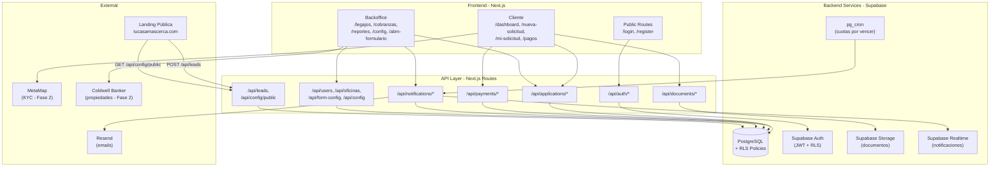
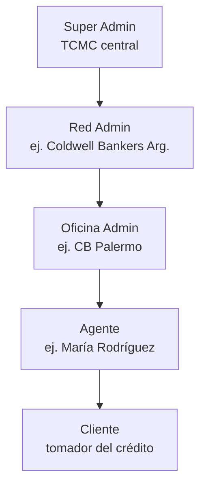
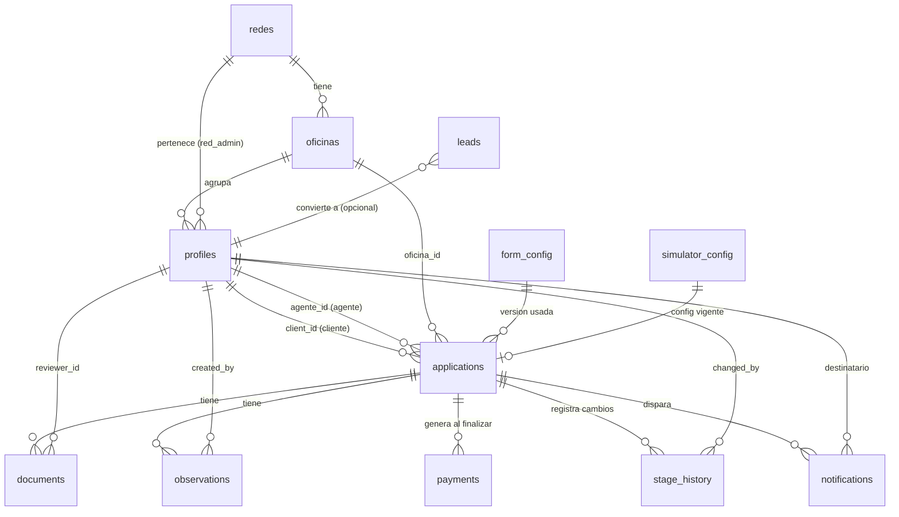
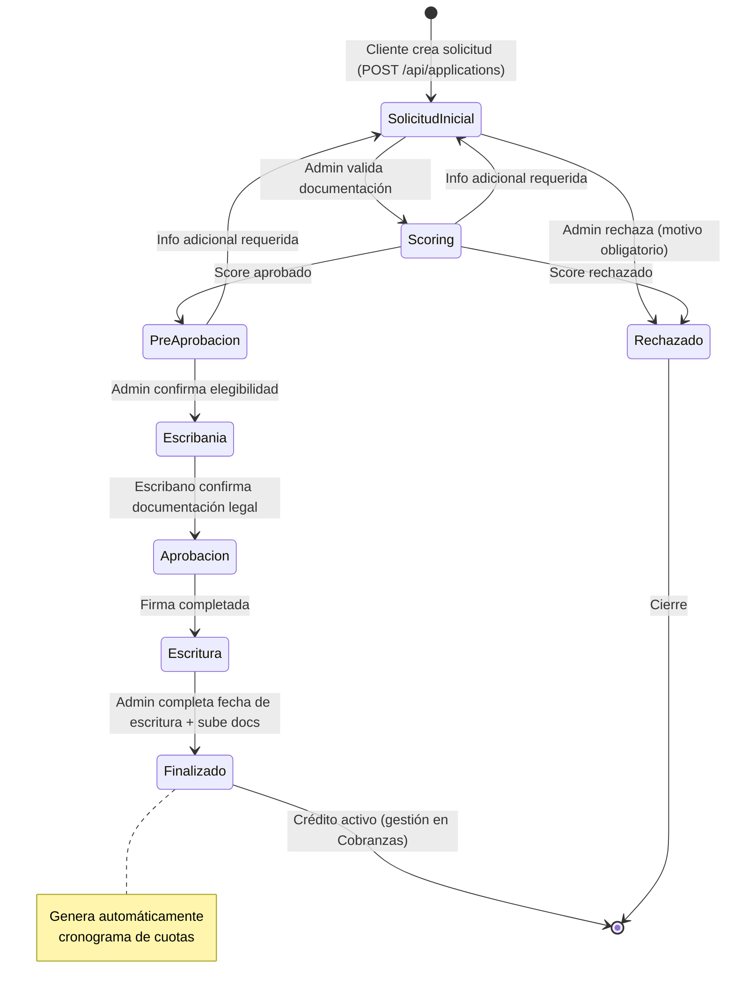
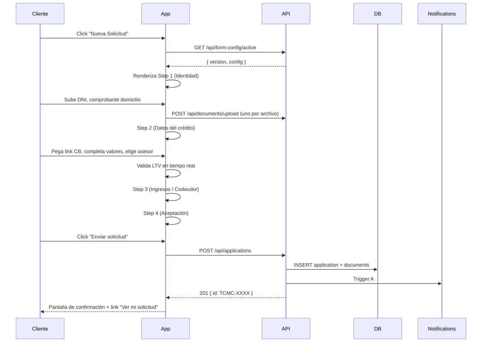

# TCMC · Especificación Técnica y Funcional — APP (Plataforma Transaccional)

**Producto:** Tu Casa +Cerca — Plataforma fintech de micro-hipotecas en USD
**Componente:** Aplicación productiva (portal cliente + backoffice + API + DB)
**Versión del documento:** 3.0 — Mayo 2026
**Audiencia:** Equipo de desarrollo Fullstack
**Estado del prototipo:** Funcional, disponible en `/prototype/app/mockup-reference.html` y combinado en `/prototype/index.html`

---

## Índice

1. Resumen Ejecutivo
2. Arquitectura General
3. Roles, Jerarquía y RBAC
4. Modelo de Datos
5. Máquina de Estados del Legajo
6. API REST — Especificación de Endpoints
7. Reglas de Negocio
8. Algoritmos Financieros
9. Sistema de Notificaciones (4 Triggers)
10. Storage de Documentos
11. ABM Formulario Dinámico
12. Paneles del Backoffice
13. Portal Cliente
14. Integraciones Externas
15. Seguridad y Auditoría
16. Deploy, DevOps y Variables de Entorno
17. Criterios de Aceptación
18. Plan de Implementación y Estimación
19. Preguntas Abiertas
20. Anexos

---

## 1. Resumen Ejecutivo

### 1.1 Qué entrega este componente (APP)

La aplicación es la **plataforma operativa completa**:

1. **Portal cliente** — Onboarding, solicitud, seguimiento, pagos, soporte.
2. **Backoffice multi-rol** — Pipeline, legajos, cobranzas, reportes, configuración.
3. **API REST** — Backend con autenticación, validación, persistencia y notificaciones.
4. **Integraciones** — Storage de documentos, email transaccional, futura integración con MetaMap y Coldwell Banker.

**Importante:** TCMC **NO maneja dinero real**. La plataforma gestiona **solicitudes, documentación, scoring, aprobaciones y registro de pagos** (informados por el cliente y validados manualmente). No procesa transferencias, débitos automáticos ni cobros online.

### 1.2 Stack recomendado

| Opción | Stack | Esfuerzo total | Cuándo elegirla |
|--------|-------|---------------|-----------------|
| **A — Recomendada** | Next.js 14 + Supabase (Postgres + Auth + Storage + Realtime) + Resend | ~80 hs | Setup rápido, RLS nativo, realtime out-of-the-box |
| **B — Self-hosted** | Next.js + Prisma + Postgres + NextAuth + AWS S3 + SendGrid | ~110 hs | Mayor control, ya hay infraestructura cloud propia |

Recomendamos **Opción A** salvo que existan razones específicas (compliance, infra preexistente).

### 1.3 Alcance MVP vs fases futuras

| Funcionalidad | MVP | Fase 2 | Fase 3 |
|---------------|-----|--------|--------|
| Auth (login, registro con aprobación, logout, RBAC) | ✅ | | |
| CRUD legajos + workflow de 8 etapas | ✅ | | |
| Upload de documentos (storage real) | ✅ | | |
| ABM dinámico del formulario | ✅ | | |
| Simulador interno + cronograma de pagos | ✅ | | |
| Panel cobranzas + legajos finalizados + CRM | ✅ | | |
| Notificaciones in-app + email (4 triggers) | ✅ | | |
| Reportes básicos + export CSV/Excel | ✅ | | |
| Realtime para notificaciones (Supabase Realtime / WebSockets) | ✅ | | |
| KYC con MetaMap | | ✅ | |
| Integración API Coldwell Banker (auto-fill propiedades) | | ✅ | |
| Scoring automático por IA | | ✅ | |
| Firma electrónica (Docusign / Zapsign) | | | ✅ |
| App mobile nativa (React Native / Expo) | | | ✅ |
| Tokenización del FCICC on-chain | | | ✅ |

---

## 2. Arquitectura General

### 2.1 Diagrama de componentes



### 2.2 Estructura de carpetas (Next.js + App Router)

```
app/
├── (public)/
│   ├── login/
│   └── register/
├── (cliente)/
│   ├── dashboard/
│   ├── nueva-solicitud/
│   ├── mi-solicitud/
│   ├── pagos/
│   └── soporte/
├── (backoffice)/
│   ├── dashboard/
│   ├── usuarios/
│   ├── oficinas/
│   ├── legajos/
│   ├── cobranzas/
│   ├── legajos-finalizados/
│   ├── reportes/
│   ├── abm-formulario/
│   └── config/
└── api/
    ├── auth/
    ├── applications/
    │   └── [id]/
    │       ├── stage/
    │       ├── notes/
    │       ├── request-info/
    │       └── documents/
    ├── documents/
    ├── payments/
    ├── notifications/
    ├── users/
    ├── oficinas/
    ├── form-config/
    ├── simulator-config/
    ├── leads/
    ├── reports/
    └── export/

src/
├── components/
│   ├── ui/                      (botones, modales, tablas reutilizables)
│   ├── shared/                  (sidebar, header, breadcrumbs)
│   ├── cliente/
│   └── backoffice/
├── lib/
│   ├── supabase/
│   │   ├── client.ts            (browser)
│   │   ├── server.ts            (server components)
│   │   └── admin.ts             (service-role)
│   ├── algorithms.ts            (re-export desde /shared/algorithms.js)
│   ├── auth.ts                  (helpers de sesión y RBAC)
│   ├── notifications.ts         (queue de notificaciones)
│   └── email/
│       ├── send.ts
│       └── templates/
└── types/
    ├── application.ts
    ├── profile.ts
    ├── payment.ts
    └── notification.ts

supabase/
├── migrations/
│   ├── 0001_init.sql            (esquema completo)
│   ├── 0002_rls_policies.sql
│   └── 0003_pg_cron.sql
└── seed.sql                     (admin inicial + redes + oficinas + form_config + simulator_config)
```

### 2.3 Ambientes y dominios

| Ambiente | App | Landing | DB |
|----------|-----|---------|----|
| Producción | `https://app.tucasamascerca.com` | `https://tucasamascerca.com` | Supabase prod |
| Staging | `https://staging-app.tucasamascerca.com` | `https://staging.tucasamascerca.com` | Supabase staging |
| Local | `http://localhost:3000` | `http://localhost:8080` | Supabase local (Docker) o instancia dev |

---

## 3. Roles, Jerarquía y RBAC

### 3.1 Jerarquía de la organización



### 3.2 Roles del sistema

| Rol | Código | Alcance | Permisos clave |
|-----|--------|---------|----------------|
| Super Admin | `super_admin` | Toda la plataforma | Configuración, ABM formulario, gestión de redes/oficinas/usuarios, todos los legajos, todos los reportes |
| Red Admin | `red_admin` | Una red completa | Legajos de su red, cambios de etapa, observaciones, cobranzas, legajos finalizados, reportes filtrados |
| Oficina Admin | `oficina_admin` | Una oficina | Dashboard de su oficina, sus agentes, sus clientes, pipeline y reportes filtrados |
| Agente | `agente` | Sus propios clientes | Dashboard personal, sus legajos, agregar observaciones, pipeline propio |
| Cliente | `cliente` | Su propio legajo | Simulador, nueva solicitud, ver estado, mis pagos, soporte |

### 3.3 Matriz de permisos (resumen)

| Acción | Cliente | Agente | Oficina | Red | Super |
|--------|:-------:|:------:|:-------:|:---:|:-----:|
| Simular crédito | ✅ | ✅ | ✅ | ✅ | ✅ |
| Crear solicitud | ✅ | — | — | — | — |
| Ver mi solicitud | ✅ | — | — | — | — |
| Ver mis pagos / informar pago | ✅ | — | — | — | — |
| Ver legajos de agente | — | ✅ (propios) | ✅ (oficina) | ✅ (red) | ✅ |
| Agregar observación | — | ✅ | ✅ | ✅ | ✅ |
| Cambiar etapa | — | — | ⚠️ limitado | ✅ | ✅ |
| Aprobar / observar documento | — | — | ✅ | ✅ | ✅ |
| Aprobar usuarios nuevos | — | — | — | ✅ (de su red) | ✅ |
| CRUD oficinas | — | — | — | ⚠️ (su red) | ✅ |
| CRUD redes | — | — | — | — | ✅ |
| Configurar tasas / LTV / máx | — | — | — | — | ✅ |
| ABM Formulario | — | — | — | — | ✅ |
| Ver reportes | — | — | ✅ (oficina) | ✅ (red) | ✅ |
| Ver legajos finalizados / cobranzas | — | — | — | ✅ | ✅ |
| Export CSV/Excel | — | — | ✅ | ✅ | ✅ |

⚠️ = permiso parcial / limitado (ver reglas específicas en sección 7).

### 3.4 Row Level Security (RLS) — políticas críticas

```sql
-- profiles: cada uno se ve a sí mismo; super_admin ve todos
CREATE POLICY "self_or_super" ON profiles
  FOR SELECT USING (
    id = auth.uid()
    OR (SELECT rol FROM profiles WHERE id = auth.uid()) = 'super_admin'
  );

-- applications: cliente solo las suyas, agente las que le asignaron, etc.
CREATE POLICY "applications_scope" ON applications
  FOR SELECT USING (
    CASE (SELECT rol FROM profiles WHERE id = auth.uid())
      WHEN 'super_admin'    THEN true
      WHEN 'red_admin'      THEN oficina_id IN (SELECT id FROM oficinas WHERE red_id = (SELECT red_id FROM profiles WHERE id = auth.uid()))
      WHEN 'oficina_admin'  THEN oficina_id = (SELECT oficina_id FROM profiles WHERE id = auth.uid())
      WHEN 'agente'         THEN agente_id  = auth.uid()
      WHEN 'cliente'        THEN client_id  = auth.uid()
      ELSE false
    END
  );

-- documents: hereda del scope del application
CREATE POLICY "documents_via_application" ON documents
  FOR SELECT USING (
    application_id IN (SELECT id FROM applications)  -- aplica policy de applications
  );
```

---

## 4. Modelo de Datos

### 4.1 Diagrama Entidad-Relación



### 4.2 Esquema PostgreSQL (DDL completo)

```sql
-- ==============================================================
-- Tipos / Enums
-- ==============================================================
CREATE TYPE rol_enum         AS ENUM ('super_admin', 'red_admin', 'oficina_admin', 'agente', 'cliente');
CREATE TYPE estado_user_enum AS ENUM ('activo', 'pendiente', 'inactivo');
CREATE TYPE stage_enum       AS ENUM ('Solicitud Inicial', 'Scoring', 'Pre Aprobación', 'Escribanía', 'Aprobación', 'Escritura', 'Finalizado', 'Rechazado');
CREATE TYPE status_enum      AS ENUM ('En Proceso', 'Finalizado', 'Rechazado');
CREATE TYPE doc_status_enum  AS ENUM ('Pendiente', 'Aprobado', 'Observado', 'No aplica');
CREATE TYPE pay_status_enum  AS ENUM ('Pendiente', 'Pagado', 'Informado', 'Vencido');
CREATE TYPE notif_type_enum  AS ENUM ('new_request', 'stage_change', 'info_request', 'payment_due');
CREATE TYPE notif_chan_enum  AS ENUM ('popup', 'email', 'both');

-- ==============================================================
-- Estructura organizacional
-- ==============================================================
CREATE TABLE redes (
  id          UUID PRIMARY KEY DEFAULT gen_random_uuid(),
  nombre      VARCHAR NOT NULL,
  codigo      VARCHAR UNIQUE NOT NULL,
  activa      BOOLEAN DEFAULT true,
  created_at  TIMESTAMPTZ DEFAULT now()
);

CREATE TABLE oficinas (
  id          UUID PRIMARY KEY DEFAULT gen_random_uuid(),
  nombre      VARCHAR NOT NULL,
  red_id      UUID NOT NULL REFERENCES redes(id) ON DELETE RESTRICT,
  direccion   VARCHAR,
  estado      VARCHAR DEFAULT 'activa' CHECK (estado IN ('activa', 'inactiva')),
  created_at  TIMESTAMPTZ DEFAULT now()
);

-- ==============================================================
-- Usuarios
-- ==============================================================
CREATE TABLE profiles (
  id              UUID PRIMARY KEY DEFAULT gen_random_uuid(),  -- = auth.users.id en Supabase
  email           VARCHAR UNIQUE NOT NULL,
  password_hash   VARCHAR,                                       -- NULL si se usa Supabase Auth
  nombre          VARCHAR NOT NULL,
  apellido        VARCHAR NOT NULL,
  dni             VARCHAR,
  phone           VARCHAR,
  rol             rol_enum NOT NULL,
  red_id          UUID REFERENCES redes(id),
  oficina_id      UUID REFERENCES oficinas(id),
  estado          estado_user_enum DEFAULT 'pendiente',
  created_at      TIMESTAMPTZ DEFAULT now(),
  approved_at     TIMESTAMPTZ,
  approved_by     UUID REFERENCES profiles(id),
  deleted_at      TIMESTAMPTZ                                   -- soft delete
);
CREATE INDEX idx_profiles_rol      ON profiles(rol);
CREATE INDEX idx_profiles_oficina  ON profiles(oficina_id);
CREATE INDEX idx_profiles_email    ON profiles(email);

-- ==============================================================
-- Legajos (Applications)
-- ==============================================================
CREATE TABLE applications (
  id                          VARCHAR PRIMARY KEY,             -- ej. "TCMC-0001"
  client_id                   UUID REFERENCES profiles(id),
  agente_id                   UUID REFERENCES profiles(id),
  oficina_id                  UUID REFERENCES oficinas(id),

  -- Snapshot del cliente al crear (audit-friendly)
  nombre                      VARCHAR NOT NULL,
  apellido                    VARCHAR NOT NULL,
  email                       VARCHAR NOT NULL,
  phone                       VARCHAR,
  dni                         VARCHAR,

  -- Propiedad
  property_link               VARCHAR,
  property_code               VARCHAR,
  property_address            VARCHAR NOT NULL,
  property_value              NUMERIC(12, 2),                  -- precio publicado CB
  offered_value               NUMERIC(12, 2) NOT NULL,         -- precio de compra (base LTV)

  -- Crédito
  loan_amount                 NUMERIC(12, 2) NOT NULL,
  months                      INT NOT NULL CHECK (months IN (12,24,36,48,60)),
  tasa_anual                  NUMERIC(5, 4),                   -- snapshot de la tasa al aprobar

  -- Ingresos + codeudor
  ingresos_anuales            NUMERIC(12, 2),
  has_codeudor                BOOLEAN DEFAULT false,
  codeudor_nombre             VARCHAR,
  codeudor_apellido           VARCHAR,
  codeudor_dni                VARCHAR,
  codeudor_vinculo            VARCHAR,
  codeudor_ingresos_anuales   NUMERIC(12, 2),

  -- Workflow
  stage                       stage_enum NOT NULL DEFAULT 'Solicitud Inicial',
  status                      status_enum NOT NULL DEFAULT 'En Proceso',

  -- Post-finalización
  fecha_escritura             DATE,
  escritura_doc               JSONB,                           -- { name, date, storage_path }
  hipoteca_doc                JSONB,

  -- Rechazo
  rejection_message           TEXT,
  rejection_date              DATE,

  -- Form Config usado
  form_config_version         INT,

  -- Audit
  created_at                  TIMESTAMPTZ DEFAULT now(),
  last_update                 TIMESTAMPTZ DEFAULT now(),
  deleted_at                  TIMESTAMPTZ,
  version                     INT DEFAULT 1                    -- optimistic locking
);
CREATE INDEX idx_applications_client   ON applications(client_id);
CREATE INDEX idx_applications_agente   ON applications(agente_id);
CREATE INDEX idx_applications_oficina  ON applications(oficina_id);
CREATE INDEX idx_applications_stage    ON applications(stage);
CREATE INDEX idx_applications_created  ON applications(created_at DESC);

-- ==============================================================
-- Documentos del legajo
-- ==============================================================
CREATE TABLE documents (
  id              UUID PRIMARY KEY DEFAULT gen_random_uuid(),
  application_id  VARCHAR NOT NULL REFERENCES applications(id) ON DELETE CASCADE,
  name            VARCHAR NOT NULL,
  doc_type        VARCHAR NOT NULL,                            -- dni_front, dni_back, comprobante_domicilio, etc.
  storage_path    VARCHAR NOT NULL,                            -- ruta en Supabase Storage / S3
  mime_type       VARCHAR,
  size_bytes      INT,
  status          doc_status_enum DEFAULT 'Pendiente',
  uploaded_at     TIMESTAMPTZ DEFAULT now(),
  uploaded_by     UUID REFERENCES profiles(id),
  reviewed_at     TIMESTAMPTZ,
  reviewer_id     UUID REFERENCES profiles(id),
  reviewer_note   TEXT
);
CREATE INDEX idx_documents_application ON documents(application_id);

-- ==============================================================
-- Observaciones (notes)
-- ==============================================================
CREATE TABLE observations (
  id              UUID PRIMARY KEY DEFAULT gen_random_uuid(),
  application_id  VARCHAR NOT NULL REFERENCES applications(id) ON DELETE CASCADE,
  text            TEXT NOT NULL,
  is_info_request BOOLEAN DEFAULT false,                       -- distingue obs internas de pedidos de info al cliente
  created_by      UUID NOT NULL REFERENCES profiles(id),
  created_at      TIMESTAMPTZ DEFAULT now()
);
CREATE INDEX idx_observations_application ON observations(application_id, created_at DESC);

-- ==============================================================
-- Cuotas (Payments)
-- ==============================================================
CREATE TABLE payments (
  id                  UUID PRIMARY KEY DEFAULT gen_random_uuid(),
  application_id      VARCHAR NOT NULL REFERENCES applications(id) ON DELETE CASCADE,
  number              INT NOT NULL,
  due_date            DATE NOT NULL,
  amount              NUMERIC(12, 2) NOT NULL,
  status              pay_status_enum DEFAULT 'Pendiente',
  pago_info           JSONB,                                   -- { fecha, monto, banco, ref_externa }
  comprobante_path    VARCHAR,                                 -- storage path del comprobante subido por cliente
  comprobante_date    DATE,
  confirmed_at        TIMESTAMPTZ,
  confirmed_by        UUID REFERENCES profiles(id),
  UNIQUE (application_id, number)
);
CREATE INDEX idx_payments_application ON payments(application_id);
CREATE INDEX idx_payments_due_date    ON payments(due_date);
CREATE INDEX idx_payments_status      ON payments(status);

-- ==============================================================
-- Historial de cambios de etapa (audit trail crítico)
-- ==============================================================
CREATE TABLE stage_history (
  id              UUID PRIMARY KEY DEFAULT gen_random_uuid(),
  application_id  VARCHAR NOT NULL REFERENCES applications(id) ON DELETE CASCADE,
  from_stage      stage_enum,
  to_stage        stage_enum NOT NULL,
  changed_by      UUID NOT NULL REFERENCES profiles(id),
  changed_at      TIMESTAMPTZ DEFAULT now(),
  note            TEXT
);
CREATE INDEX idx_stage_history_application ON stage_history(application_id, changed_at);

-- ==============================================================
-- Notificaciones
-- ==============================================================
CREATE TABLE notifications (
  id              UUID PRIMARY KEY DEFAULT gen_random_uuid(),
  profile_id      UUID NOT NULL REFERENCES profiles(id) ON DELETE CASCADE,
  type            notif_type_enum NOT NULL,
  title           VARCHAR NOT NULL,
  message         TEXT NOT NULL,
  application_id  VARCHAR REFERENCES applications(id),
  channel         notif_chan_enum DEFAULT 'both',
  read            BOOLEAN DEFAULT false,
  email_sent      BOOLEAN DEFAULT false,
  email_sent_at   TIMESTAMPTZ,
  extra           JSONB,                                       -- payload adicional (ej. payment number)
  created_at      TIMESTAMPTZ DEFAULT now()
);
CREATE INDEX idx_notifications_profile  ON notifications(profile_id, read, created_at DESC);
CREATE INDEX idx_notifications_app      ON notifications(application_id);

-- ==============================================================
-- Configuración del formulario (versionada)
-- ==============================================================
CREATE TABLE form_config (
  id              UUID PRIMARY KEY DEFAULT gen_random_uuid(),
  version         INT NOT NULL,
  config          JSONB NOT NULL,
  is_active       BOOLEAN DEFAULT false,
  created_by      UUID REFERENCES profiles(id),
  created_at      TIMESTAMPTZ DEFAULT now()
);
CREATE UNIQUE INDEX idx_form_config_active ON form_config (is_active) WHERE is_active = true;

-- ==============================================================
-- Configuración del simulador (versionada)
-- ==============================================================
CREATE TABLE simulator_config (
  id              UUID PRIMARY KEY DEFAULT gen_random_uuid(),
  version         INT NOT NULL,
  tasas_base      JSONB NOT NULL,                              -- { "12": 0.095, "24": 0.105, ... }
  max_ltv         NUMERIC(4, 4) NOT NULL DEFAULT 0.35,
  max_loan        NUMERIC(12, 2) NOT NULL DEFAULT 50000,
  is_active       BOOLEAN DEFAULT false,
  created_by      UUID REFERENCES profiles(id),
  created_at      TIMESTAMPTZ DEFAULT now()
);
CREATE UNIQUE INDEX idx_simulator_config_active ON simulator_config (is_active) WHERE is_active = true;

-- ==============================================================
-- Leads (capturados desde la landing)
-- ==============================================================
CREATE TABLE leads (
  id              UUID PRIMARY KEY DEFAULT gen_random_uuid(),
  email           VARCHAR NOT NULL,
  phone           VARCHAR,
  quote           JSONB,                                       -- { propertyValue, loanAmount, months, cuota, tna, bruto }
  source          VARCHAR,                                     -- landing_simulator, contact_form, etc.
  utm             JSONB,                                       -- { source, medium, campaign }
  ip              INET,
  user_agent      TEXT,
  converted_to    UUID REFERENCES profiles(id),                -- si se convirtió en cliente
  created_at      TIMESTAMPTZ DEFAULT now()
);
CREATE INDEX idx_leads_email ON leads(email);
CREATE INDEX idx_leads_created ON leads(created_at DESC);

-- ==============================================================
-- Audit log genérico (opcional, recomendado para compliance)
-- ==============================================================
CREATE TABLE audit_log (
  id              BIGSERIAL PRIMARY KEY,
  actor_id        UUID REFERENCES profiles(id),
  action          VARCHAR NOT NULL,                            -- CREATE, UPDATE, DELETE, LOGIN, etc.
  entity_type     VARCHAR NOT NULL,                            -- application, document, payment, etc.
  entity_id       VARCHAR,
  before          JSONB,
  after           JSONB,
  ip              INET,
  created_at      TIMESTAMPTZ DEFAULT now()
);
CREATE INDEX idx_audit_actor ON audit_log(actor_id, created_at DESC);
CREATE INDEX idx_audit_entity ON audit_log(entity_type, entity_id);
```

### 4.3 Reglas de integridad y triggers

```sql
-- Generador de ID legible TCMC-NNNN
CREATE SEQUENCE seq_application_number START 1;

CREATE OR REPLACE FUNCTION generate_application_id() RETURNS TRIGGER AS $$
BEGIN
  IF NEW.id IS NULL THEN
    NEW.id := 'TCMC-' || LPAD(nextval('seq_application_number')::text, 4, '0');
  END IF;
  RETURN NEW;
END;
$$ LANGUAGE plpgsql;

CREATE TRIGGER trg_application_id BEFORE INSERT ON applications
  FOR EACH ROW EXECUTE FUNCTION generate_application_id();

-- Actualización automática de last_update
CREATE OR REPLACE FUNCTION update_last_update() RETURNS TRIGGER AS $$
BEGIN
  NEW.last_update := now();
  NEW.version := COALESCE(OLD.version, 0) + 1;
  RETURN NEW;
END;
$$ LANGUAGE plpgsql;

CREATE TRIGGER trg_application_update BEFORE UPDATE ON applications
  FOR EACH ROW EXECUTE FUNCTION update_last_update();

-- Registro de cambios de etapa en stage_history
CREATE OR REPLACE FUNCTION log_stage_change() RETURNS TRIGGER AS $$
BEGIN
  IF OLD.stage IS DISTINCT FROM NEW.stage THEN
    INSERT INTO stage_history (application_id, from_stage, to_stage, changed_by)
    VALUES (NEW.id, OLD.stage, NEW.stage, auth.uid());
  END IF;
  RETURN NEW;
END;
$$ LANGUAGE plpgsql;

CREATE TRIGGER trg_stage_history AFTER UPDATE ON applications
  FOR EACH ROW EXECUTE FUNCTION log_stage_change();
```

---

## 5. Máquina de Estados del Legajo

### 5.1 Diagrama



### 5.2 Transiciones permitidas (matriz)

| Desde \ Hacia | Sol. Inicial | Scoring | Pre Aprob. | Escribanía | Aprobación | Escritura | Finalizado | Rechazado |
|---------------|:------------:|:-------:|:----------:|:----------:|:----------:|:---------:|:----------:|:---------:|
| **Solicitud Inicial** | — | ✅ | — | — | — | — | — | ✅ |
| **Scoring** | ↩️ | — | ✅ | — | — | — | — | ✅ |
| **Pre Aprobación** | ↩️ | — | — | ✅ | — | — | — | ✅ |
| **Escribanía** | — | — | — | — | ✅ | — | — | ✅ |
| **Aprobación** | — | — | — | — | — | ✅ | — | ✅ |
| **Escritura** | — | — | — | — | — | — | ✅ ⚠️ | ✅ |
| **Finalizado** | — | — | — | — | — | — | — | — |
| **Rechazado** | — | — | — | — | — | — | — | — |

↩️ Vuelta atrás permitida solo si se solicita info adicional (deja observación obligatoria).
⚠️ Para pasar a Finalizado se exige `fecha_escritura` y todos los documentos en estado `Aprobado` o `No aplica`.

### 5.3 Reglas por transición

| Transición | Quién puede | Pre-condiciones | Acciones automáticas |
|-----------|-------------|-----------------|---------------------|
| → Scoring | super_admin, red_admin | Docs Step 1 aprobados | Notif B (cambio de estado) a agente + oficina + cliente |
| → Pre Aprobación | super_admin, red_admin | Scoring positivo registrado | Notif B |
| → Escribanía | super_admin, red_admin | Pre Aprobación confirmada | Notif B |
| → Aprobación | super_admin, red_admin | Documentación escribanía OK | Notif B |
| → Escritura | super_admin, red_admin | — | Notif B |
| → Finalizado | super_admin, red_admin | `fecha_escritura` ≠ NULL, todos docs `Aprobado`/`No aplica` | `generatePaymentSchedule()` → inserta `payments`. Notif B. |
| → Rechazado (cualquier estado) | super_admin, red_admin | `rejection_message` no vacío | `status = 'Rechazado'`. Notif B. |
| → Solicitud Inicial (rollback) | super_admin, red_admin | Observación con `is_info_request = true` | Notif C (pedido de info). |

---

## 6. API REST — Especificación de Endpoints

### 6.1 Convenciones generales

- **Base URL:** `https://app.tucasamascerca.com/api`
- **Auth:** Cookie HttpOnly `tcmc_token` (JWT) o `Authorization: Bearer <token>` para integraciones server-to-server.
- **Content-Type:** `application/json` excepto uploads (`multipart/form-data`).
- **Errores:** Estructura uniforme:

```json
{
  "error": {
    "code": "VALIDATION_ERROR",
    "message": "Email is required",
    "details": { "field": "email" }
  }
}
```

- **Códigos:** 200 OK · 201 Created · 204 No Content · 400 Bad Request · 401 Unauthorized · 403 Forbidden · 404 Not Found · 409 Conflict · 422 Unprocessable · 429 Too Many Requests · 500 Internal.
- **Paginación:** `?page=1&pageSize=20` → `{ data: [...], meta: { page, pageSize, total } }`.
- **Validación:** Zod (TypeScript) o equivalente en cada endpoint, server-side, **no confiar en validaciones de frontend**.

### 6.2 Auth

```http
POST /api/auth/register
Body: { email, password, nombre, apellido, dni, phone, rol? }
Response 201: { profileId, estado: 'pendiente' }
Notas: rol default 'cliente'. Si rol != cliente, requiere aprobación admin.

POST /api/auth/login
Body: { email, password }
Response 200: Set-Cookie tcmc_token=... + { profile }
Errores: 401 si credenciales inválidas, 403 si estado != activo

POST /api/auth/logout
Response 204: Clear-Cookie

GET /api/auth/me
Response 200: { profile completo del usuario actual }
```

### 6.3 Applications (Legajos)

```http
GET /api/applications
Query: ?stage=&search=&agenteId=&oficinaId=&from=&to=&page=1&pageSize=20
Auth: cualquier rol (RLS filtra automáticamente)
Response 200: { data: Application[], meta }

GET /api/applications/:id
Auth: scope automático por RLS
Response 200: Application completo con documents, observations, payments, stage_history

POST /api/applications
Auth: cliente
Body: { propertyLink?, propertyCode?, propertyAddress, propertyValue, offeredValue, loanAmount, months, ingresosAnuales, hasCodeudor, codeudor*, advisor }
Response 201: { id: 'TCMC-XXXX', stage: 'Solicitud Inicial' }
Notas: Trigger A (notif new_request) a admin, agente, oficina, cliente.

PATCH /api/applications/:id
Auth: red_admin+
Body: { campos editables }
Response 200: Application actualizado
Notas: optimistic locking vía If-Match: <version> → 409 si conflicto.

POST /api/applications/:id/stage
Auth: red_admin+
Body: { to: 'Pre Aprobación', note?, fechaEscritura?, rejectionMessage? }
Response 200: Application
Validaciones: transición permitida (sección 5.2), campos obligatorios según destino.
Notas: Trigger B. Si to=Finalizado → genera payments. Si to=Rechazado → status=Rechazado.

POST /api/applications/:id/notes
Auth: agente+
Body: { text, isInfoRequest?: bool }
Response 201: Observation
Notas: Si isInfoRequest=true → Trigger C (notif info_request al cliente).

POST /api/applications/:id/request-info
Auth: red_admin+
Body: { text }
Response 201: { observationId }
Notas: Atajo de POST /notes con isInfoRequest=true. Puede revertir stage a 'Solicitud Inicial' opcionalmente.
```

### 6.4 Documents

```http
POST /api/documents/upload
Auth: cliente (sube los suyos), reviewer (puede subir post-finalización: escritura, hipoteca)
Body: multipart/form-data { file, applicationId, docType }
Response 201: { id, name, status: 'Pendiente', storagePath }
Validaciones: MIME en {pdf, jpg, png}, size <= 10 MB.

PATCH /api/documents/:id/status
Auth: oficina_admin+
Body: { status: 'Aprobado'|'Observado'|'No aplica', reviewerNote? }
Response 200: Document

GET /api/documents/:id/url
Auth: scope vía application
Response 200: { signedUrl, expiresAt }
Notas: Signed URL con TTL 1 hora.
```

### 6.5 Payments

```http
GET /api/payments?applicationId=TCMC-0001
Auth: scope del application
Response 200: Payment[]

PATCH /api/payments/:id
Auth: cliente (informa pago) / oficina_admin+ (confirma)
Body cliente: { pagoInfo: { fecha, monto, banco, ref }, comprobantePath? } → status pasa a 'Informado'
Body admin: { status: 'Pagado', confirmedAt } → status pasa a 'Pagado'
Response 200: Payment

POST /api/payments/:id/comprobante
Auth: cliente
Body: multipart/form-data { file }
Response 201: { storagePath }
```

### 6.6 Notifications

```http
GET /api/notifications?unreadOnly=true&page=1&pageSize=20
Auth: usuario actual
Response 200: { data: Notification[], meta, unreadCount }

PATCH /api/notifications/:id/read
Response 200: Notification

PATCH /api/notifications/read-all
Response 204
```

### 6.7 Users / Oficinas / Redes

```http
GET /api/users
Auth: oficina_admin+ (filtrado por scope)

PATCH /api/users/:id
Auth: red_admin+
Body: { estado?, rol?, oficinaId?, redId? }
Notas: aprobación = setear estado='activo'.

POST /api/users/bulk-import
Auth: red_admin+
Body: multipart/form-data { file: CSV }
Response 200: { imported, errors[] }

GET /api/oficinas
GET /api/oficinas/:id
POST /api/oficinas       — Auth: red_admin+
PATCH /api/oficinas/:id  — Auth: red_admin+

GET /api/redes
POST /api/redes          — Auth: super_admin
PATCH /api/redes/:id     — Auth: super_admin
```

### 6.8 Form Config y Simulator Config

```http
GET /api/form-config/active
Auth: cualquier rol
Response 200: { version, config }
Notas: Consumido por el wizard del cliente para renderizado dinámico.

GET /api/form-config
Auth: super_admin
Response 200: { versions: [...] }

PUT /api/form-config
Auth: super_admin
Body: { config }
Response 201: { version, config, isActive: true }
Notas: Crea nueva versión, desactiva la anterior.

GET /api/simulator-config/public
Auth: público (CORS para landing)
Response 200: { tasasBase, maxLTV, maxLoan, version, updatedAt }

PUT /api/simulator-config
Auth: super_admin
Body: { tasasBase, maxLTV, maxLoan }
Response 201: { version, isActive: true }
```

### 6.9 Leads

```http
POST /api/leads
Auth: público (CORS para landing)
Body: { email, phone?, quote, source, utm? }
Rate limit: 5/min por IP, 100/día por IP
Response 201: { leadId }
Errores: 400 si email inválido, 429 si rate limit
```

### 6.10 Reports y Export

```http
GET /api/reports/pipeline
Auth: oficina_admin+
Query: ?oficinaId=&from=&to=
Response 200: {
  stages: [
    { stage: 'Solicitud Inicial', count, volumen, ticketPromedio, diasPromedio },
    ...
  ]
}

GET /api/reports/agents
Auth: red_admin+
Response 200: AgentPerformance[]

GET /api/reports/financial
Auth: red_admin+
Response 200: { volumenTotal, cobranza, morosidad, ... }

GET /api/export/csv?type=legajos&filters=...
GET /api/export/excel?type=cobranzas&filters=...
Auth: oficina_admin+
Response 200: file download
```

---

## 7. Reglas de Negocio

### 7.1 Solicitud

- **Documentos obligatorios al crear:** los marcados `required: true` en `form_config.active`.
- **LTV efectivo** = `loan_amount / offered_value`. Debe ser ≤ `simulator_config.max_ltv` (35%).
- **Monto máximo** = `simulator_config.max_loan` (USD 50.000).
- **Plazos válidos:** 12, 24, 36, 48, 60 meses.
- **Propiedad:** debe tener `property_address` no vacío. Si `property_link` se completa, se intenta extraer `property_code` con regex.
- **Codeudor:** si `has_codeudor = true`, todos los campos `codeudor_*` son obligatorios.
- **Asesor:** obligatorio. Se asigna `agente_id` y `oficina_id` automáticamente desde el perfil del agente.

### 7.2 Workflow

- **Solo super_admin / red_admin** pueden cambiar etapas. `oficina_admin` puede aprobar/observar documentos.
- **Documentos en `Observado`:** bloquean el avance hacia Pre Aprobación.
- **Pasaje a Finalizado:** se exige `fecha_escritura` y que **todos** los docs estén en `Aprobado` o `No aplica`. La fecha de escritura puede ser pasada (cuando se carga retroactivamente) o futura.
- **Rechazo:** `rejection_message` obligatorio (mínimo 20 caracteres). Setea `status = 'Rechazado'`.
- **Audit:** todo cambio de etapa se loguea en `stage_history`. Toda observación queda en `observations`. Toda acción crítica queda en `audit_log`.

### 7.3 Cuotas

- **Generación:** al pasar a Finalizado, se ejecuta `generatePaymentSchedule()` que crea N filas en `payments` con `status = 'Pendiente'`.
- **Primera cuota:** vence el mismo día del mes siguiente a `fecha_escritura`.
- **Tasa snapshot:** se persiste `applications.tasa_anual` con la tasa vigente al momento de Finalizar. Cambios posteriores en `simulator_config` **no afectan** los legajos ya finalizados.
- **Estados de cuota:**
  - `Pendiente` (default)
  - `Informado` (cliente subió comprobante)
  - `Pagado` (admin confirmó)
  - `Vencido` (cron diario: fecha pasada + no pagado)
- **Cron de vencimiento:** Job diario a las 03:00 ART que marca como `Vencido` toda cuota con `due_date < CURRENT_DATE AND status = 'Pendiente'`.

### 7.4 Documentos

- **Tipos canónicos** (campo `doc_type`):
  - `dni_front`, `dni_back`
  - `comprobante_domicilio`
  - `declaracion_ingresos`, `recibos_sueldo`, `renta_presunta`
  - `reserva_credito`
  - `codeudor_dni_front`, `codeudor_dni_back`, `codeudor_ingresos`
  - `escritura` (post-Finalizado)
  - `hipoteca` (post-Finalizado)
- **Tamaño máx:** 10 MB.
- **Formatos:** PDF, JPG, PNG.
- **Storage privado:** todo documento es privado por default; se accede con signed URL TTL 1 h.

### 7.5 Notificaciones

- **Idempotencia:** una notificación no puede dispararse dos veces para el mismo evento (constraint a nivel aplicación: chequear `notifications` antes de insertar).
- **Email:** se intenta enviar via Resend. Si falla, queda `email_sent = false` y se reintenta en background.
- **In-app:** se inserta en `notifications`; el frontend la levanta vía Supabase Realtime o polling.

---

## 8. Algoritmos Financieros

Todos viven en `/shared/algorithms.js` y se importan tanto en frontend como backend. **No duplicar lógica.**

### 8.1 Monto bruto

```javascript
function calcularBruto(prestamo) {
  const upfront = prestamo * 0.05;
  const iva = upfront * 0.21;
  return prestamo + upfront + iva;
}
```

### 8.2 Cuota mensual (PMT — sistema francés)

```javascript
function calcularCuota(tasaAnual, meses, bruto) {
  const tm = tasaAnual / 12;
  return bruto * (tm * Math.pow(1 + tm, meses)) / (Math.pow(1 + tm, meses) - 1);
}
```

### 8.3 TNA aproximada anualizada

```javascript
function calcularTNA(cuotaMensual, meses, prestamo) {
  const td = (cuotaMensual * meses) / prestamo - 1;
  return Math.pow(1 + td, 12 / meses) - 1;
}
```

### 8.4 Cronograma de pagos

```javascript
function generatePaymentSchedule(loanAmount, months, fechaEscritura, tasaAnual) {
  const bruto = calcularBruto(loanAmount);
  const cuota = calcularCuota(tasaAnual, months, bruto);
  const startDate = new Date(fechaEscritura);
  const payments = [];
  for (let i = 1; i <= months; i++) {
    const dueDate = new Date(startDate);
    dueDate.setMonth(dueDate.getMonth() + i);
    payments.push({
      number: i,
      dueDate: dueDate.toISOString().split('T')[0],
      amount: Math.round(cuota * 100) / 100,
      status: 'Pendiente'
    });
  }
  return payments;
}
```

### 8.5 Estado de legajo finalizado (atraso)

```javascript
function getEstadoLoan(loan) {
  const today = new Date();
  const vencidas = (loan.payments || []).filter(p =>
    p.status !== 'Pagado' && new Date(p.dueDate) < today
  );
  if (vencidas.length === 0) return { label: 'Al día', key: 'aldia', color: 'green' };
  const maxDias = Math.max(...vencidas.map(p =>
    Math.floor((today - new Date(p.dueDate)) / 86400000)
  ));
  if (maxDias <= 5) return { label: `Atraso ${maxDias}d`, key: 'atraso5',     color: 'amber' };
  return                  { label: `Atraso ${maxDias}d`, key: 'atraso5plus', color: 'red'   };
}
```

### 8.6 Casos borde / validaciones

- `tasaAnual = 0` → división por cero en PMT; tratar como caso especial: `cuota = bruto / meses`.
- `meses = 0` → error explícito.
- `loanAmount > propertyValue * maxLTV` → error 422 "LTV excedido".
- Redondeo: cuotas se redondean a 2 decimales con `Math.round(x * 100) / 100`. La última cuota puede ajustarse para cuadrar el total (rounding error).

---

## 9. Sistema de Notificaciones (4 Triggers)

### 9.1 Trigger A — Nueva Solicitud

| Atributo | Valor |
|----------|-------|
| Disparador | `POST /api/applications` exitoso |
| Destinatarios | super_admin (back office), agente asignado, jefe de oficina del agente, **cliente** |
| Canal | Email + Pop-up in-app |
| Idempotencia | Una sola notif por `application_id` y `type=new_request` |
| Template subject | `[Tu Casa +Cerca] Nueva Solicitud de Crédito` |
| Template body | `{nombre} {apellido} solicitó USD {loanAmount} a {months} meses para inmueble en {propertyAddress}` |

### 9.2 Trigger B — Cambio de Estado

| Atributo | Valor |
|----------|-------|
| Disparador | `POST /api/applications/:id/stage` exitoso |
| Destinatarios | agente, oficina, cliente. **NO al back office** (evita saturarlos) |
| Canal | Email + Pop-up |
| Idempotencia | Una por transición (`stage_history.id`) |
| Subject | `[Tu Casa +Cerca] Cambio de Etapa` |
| Body | `El legajo de {nombre} {apellido} cambió de {fromStage} a {toStage}` |

### 9.3 Trigger C — Pedido de Información

| Atributo | Valor |
|----------|-------|
| Disparador | `POST /api/applications/:id/notes` con `isInfoRequest=true` |
| Destinatarios | agente, oficina, **cliente** |
| Canal | Email + Pop-up |
| Subject | `[Tu Casa +Cerca] Nueva observación en su legajo` |
| Body | `Se agregó una observación en el legajo de {nombre}: "{text}"` |

### 9.4 Trigger D — Cuota por Vencer

| Atributo | Valor |
|----------|-------|
| Disparador | Cron diario 09:00 ART. Busca cuotas con `due_date` entre hoy y hoy+7 días, status `Pendiente`, sin notif previa. |
| Destinatarios | Solo el cliente |
| Canal | Email + Pop-up |
| Subject | `[Tu Casa +Cerca] Cuota próxima a vencer` |
| Body | `Recordatorio: Su cuota #{number} por USD {amount} vence el {dueDate}` |
| Idempotencia | Constraint en `notifications` (no insertar si ya existe `type=payment_due` + `application_id` + `extra->>'number' = number`) |

### 9.5 Implementación de Trigger D (pg_cron)

```sql
SELECT cron.schedule(
  'check-due-payments',
  '0 9 * * *',  -- 09:00 todos los días
  $$
  INSERT INTO notifications (profile_id, type, title, message, application_id, channel, extra)
  SELECT
    a.client_id,
    'payment_due'::notif_type_enum,
    'Cuota próxima a vencer',
    'Su cuota #' || pay.number || ' por USD ' || pay.amount || ' vence el ' || pay.due_date,
    a.id,
    'both'::notif_chan_enum,
    jsonb_build_object('payment_id', pay.id, 'number', pay.number)
  FROM payments pay
  JOIN applications a ON pay.application_id = a.id
  WHERE pay.status = 'Pendiente'
    AND pay.due_date BETWEEN CURRENT_DATE AND CURRENT_DATE + INTERVAL '7 days'
    AND NOT EXISTS (
      SELECT 1 FROM notifications n
      WHERE n.type = 'payment_due'
        AND n.application_id = a.id
        AND (n.extra->>'payment_id')::uuid = pay.id
    );
  $$
);
```

### 9.6 Template base de email

```html
<div style="font-family: Poppins, Arial, sans-serif; max-width: 600px; margin: auto;">
  
  <h2 style="color: #1A4394;">{{title}}</h2>
  <p>Hola {{nombre}},</p>
  <p>{{message}}</p>
  <a href="{{appUrl}}/legajo/{{applicationId}}"
     style="display: inline-block; padding: 12px 24px; background: #1A4394;
            color: #fff; text-decoration: none; border-radius: 8px; font-weight: 600;">
    Ver en la plataforma
  </a>
  <hr style="margin: 32px 0; border: 0; border-top: 1px solid #E1EAEB;" />
  <p style="color: #748082; font-size: 12px;">
    Tu Casa +Cerca — Plataforma de Créditos Hipotecarios.
    Si no querés recibir estos mails, podés actualizar tus preferencias <a href="{{prefsUrl}}">acá</a>.
  </p>
</div>
```

---

## 10. Storage de Documentos

### 10.1 Estructura de paths

```
tcmc-documents/
  {application_id}/
    dni_front_{timestamp}.{ext}
    dni_back_{timestamp}.{ext}
    comprobante_domicilio_{timestamp}.{ext}
    declaracion_ingresos_{timestamp}.{ext}
    reserva_credito_{timestamp}.{ext}
    codeudor/
      codeudor_dni_front_{timestamp}.{ext}
      codeudor_dni_back_{timestamp}.{ext}
      codeudor_ingresos_{timestamp}.{ext}
    post-finalizacion/
      escritura_{timestamp}.{ext}
      hipoteca_{timestamp}.{ext}
    comprobantes-pago/
      cuota_{number}_{timestamp}.{ext}
```

### 10.2 Políticas de acceso

- **Bucket:** `tcmc-documents` (privado).
- **Subida (cliente):** vía `POST /api/documents/upload`, valida MIME + size, genera path único, sube a Supabase Storage / S3.
- **Lectura:** signed URL con TTL 1 h (`POST /api/documents/:id/url`). Solo accesible si el usuario tiene scope sobre el `application_id`.
- **Cifrado at-rest:** AES-256 (default Supabase / S3).
- **Backups:** snapshot diario + retención 30 días.

---

## 11. ABM Formulario Dinámico

### 11.1 Modelo de datos

`form_config.config` (JSONB) tiene la estructura completa del formulario:

```json
{
  "titulo": "Nueva Solicitud de Crédito",
  "steps": [
    {
      "id": "step1",
      "titulo": "Verificación de Identidad",
      "hidden": false,
      "questions": [
        {
          "id": "dniFrente",
          "label": "DNI Frente",
          "type": "file",
          "required": true,
          "hidden": false,
          "helpText": "Click para subir imagen"
        }
      ]
    }
  ]
}
```

### 11.2 Tipos de pregunta soportados

| `type` | Render | Validación |
|--------|--------|-----------|
| `text` | `<input type="text">` | minLength, maxLength |
| `textarea` | `<textarea>` | maxLength |
| `number` | `<input type="number">` | min, max, decimal |
| `url` | `<input type="url">` | regex URL |
| `date` | `<input type="date">` | min/max date |
| `select` | `<select>` con `options[]` | value debe estar en options |
| `checkbox` | `<input type="checkbox">` | booleano |
| `boolean` | `<Switch>` | boolean (sí/no) |
| `file` | `<input type="file">` | MIME + size |
| `info` | `<p>` (read-only) | — |

### 11.3 Dependencias condicionales

```json
{ "id": "codeudorNombre", "dependsOn": "hasCodeudor", ... }
```

Renderizado: la pregunta `codeudorNombre` solo se muestra si `formData.hasCodeudor === true`.

### 11.4 Renderizado dinámico (frontend)

```tsx
function ClientNewRequestWizard({ formConfig }: { formConfig: FormConfig }) {
  const [step, setStep] = useState(0);
  const [data, setData] = useState<Record<string, any>>({});

  const visibleSteps = formConfig.steps.filter(s => !s.hidden);
  const currentStep  = visibleSteps[step];
  const questions    = currentStep.questions.filter(q =>
    !q.hidden && (!q.dependsOn || data[q.dependsOn])
  );

  return (
    <form onSubmit={handleSubmit}>
      <h2>{currentStep.titulo}</h2>
      {questions.map(q => <FieldRenderer key={q.id} question={q} value={data[q.id]} onChange={...} />)}
      <Nav step={step} total={visibleSteps.length} onNext={...} onBack={...} />
    </form>
  );
}
```

### 11.5 Versionado

- Al guardar (`PUT /api/form-config`):
  1. Calcular `version = SELECT MAX(version)+1 FROM form_config`.
  2. `UPDATE form_config SET is_active = false WHERE is_active = true`.
  3. `INSERT INTO form_config (version, config, is_active) VALUES (v, cfg, true)`.
- Cada `application` guarda `form_config_version` para reconstruir el formulario original (audit/legal).

### 11.6 Editor (UI super_admin)

Estilo "Google Forms":
- Lista de pasos a la izquierda, drag-and-drop para reordenar.
- Panel central: pregunta seleccionada con editor de `label`, `type`, `required`, `hidden`, `placeholder`, `helpText`, `options`, `dependsOn`.
- Preview en tiempo real del wizard tal como lo vería el cliente.
- Botones: "Guardar (nueva versión)", "Restaurar por defecto", "Cancelar".

---

## 12. Paneles del Backoffice

### 12.1 Dashboard (todos los roles)

- KPIs cards: total clientes, volumen total (USD), aprobados (Escritura + Finalizado), en proceso.
- Distribución por etapa (grilla horizontal con conteos + barra de progreso).
- Últimas 5 actividades (registro de cambios + observaciones recientes).
- Acceso rápido a "Nueva Solicitud" (si es agente que opera por cliente).

### 12.2 Gestión de Usuarios (super_admin)

- Tabla con búsqueda + filtros (rol, estado, oficina).
- Acciones: aprobar/rechazar pendientes, cambiar rol, asignar oficina, desactivar.
- Bulk import via CSV: parsea, valida, muestra preview, confirma → `POST /api/users/bulk-import`.
- Email de bienvenida automático al aprobar.

### 12.3 Gestión de Oficinas (super_admin / red_admin)

- CRUD: crear, editar nombre/dirección, activar/desactivar.
- Asociar oficina a red.
- Métricas inline: cantidad de agentes activos, legajos en proceso, volumen.

### 12.4 Gestión de Legajos (red_admin+)

- Tabla maestra con filtros: nombre, apellido, DNI, stage (multi-select), agente, oficina, rango de fechas.
- Columnas: ID (TCMC-XXXX), Tomador, Inmueble (dirección + link), Valor publicado, Valor ofertado, Monto solicitado, Etapa (con color), Asesor, Fecha inicio.
- Sort por cualquier columna.
- Click en fila → modal detallado (max-w-5xl) con:
  - Sección 1: Datos del cliente y propiedad.
  - Sección 2: Información financiera + codeudor.
  - Sección 3: Documentos (lista con estados, botones aprobar/observar/subir).
  - Sección 4: Cambio de etapa (dropdown con etapas válidas + campos condicionales: `fechaEscritura` para Finalizado, `rejectionMessage` para Rechazado).
  - Sección 5: Observaciones (textarea para agregar + historial reverso cronológico).
- Export CSV/Excel.

**Colores por stage:**

| Stage | Color |
|-------|-------|
| Solicitud Inicial | slate |
| Scoring | amber |
| Pre Aprobación | blue |
| Escribanía | purple |
| Aprobación | indigo |
| Escritura | cyan |
| Finalizado | green |
| Rechazado | red |

### 12.5 Pipeline (todos los admin)

Vista kanban/funnel por etapa. Cada columna muestra:
- Nombre de la etapa + count + volumen acumulado.
- Cards con info resumida del legajo: tomador, monto, días en etapa, asesor.
- Click en card → mismo modal que en Gestión de Legajos.

### 12.6 Cobranzas (red_admin+)

Matriz agrupada por año-mes (solo cuotas de legajos en estado Finalizado).

| Columna | Descripción |
|---------|-------------|
| Año | YYYY |
| Mes | MM (con label texto: Enero, Febrero...) |
| Cant. Total | Cantidad de cuotas con `due_date` en ese mes |
| Monto Total | Suma de `amount` |
| Pagadas | Cantidad con status=Pagado |
| Monto Pagado | Suma de Pagadas |
| Informadas | Cantidad con status=Informado |
| Pendientes | Cantidad con status=Pendiente |
| Vencidas | Cantidad con status=Vencido |
| % Cobro | Pagadas / Total × 100 |

- Filtro por año.
- Drill-down: click en fila expande las cuotas individuales del mes con opción de registrar pago manual (admin).
- Registro de pago: fecha, monto, banco, referencia, comprobante (URL).
- Export CSV / Excel.

### 12.7 Legajos Finalizados (red_admin+)

Tabla de legajos en estado Finalizado con su estado de pago agregado.

| Columna | Alineación |
|---------|-----------|
| Tomador | izquierda |
| Dir. Inmueble | izquierda |
| Monto Tomado (USD) | derecha |
| Valor de Compra (USD) | derecha |
| Total Cuotas (Q) | derecha |
| Total Cuotas (USD) | derecha |
| Cuotas Pend. (Q) | derecha |
| Cuotas Pend. (USD) | derecha |
| Estado | centro |

- Sort por cualquier columna.
- Filtro texto (tomador o dirección).
- Filtro estado (dropdown: Todos / Al día / Atraso ≤5d / Atraso >5d).
- Export CSV/Excel.
- Click en fila → **Modal CRM** (ver 12.8).

### 12.8 Modal CRM del Legajo Finalizado

Modal max-w-5xl con 6 secciones:

1. **Datos del Cliente** — Nombre, DNI, email, teléfono, asesor, fecha de inicio.
2. **Datos del Inmueble** — Dirección, valores, LTV calculado, link propiedad.
3. **Datos del Préstamo** — Monto, plazo, cuota, tasa, fecha de escritura, monto bruto.
4. **Documentos + Post-Finalización** — Lista de docs con estados + botones para subir **Escritura** y **Hipoteca** (pueden cargarse días después de Finalizar).
5. **Historial de Pagos** — Tabla: # / vencimiento / monto / estado (con color) / info de pago.
6. **Observaciones** — Textarea para agregar + historial.

### 12.9 Reportes (oficina_admin+)

Tres tabs:

- **Pipeline:** cantidad, volumen, ticket promedio, días promedio por etapa.
- **Performance Agentes:** agente / oficina / clientes / volumen / finalizados / rechazados / tasa conversión.
- **Resumen Financiero:** volumen total, cobranza, morosidad.

Export Excel.

### 12.10 ABM Formulario (super_admin)

Editor Google-Forms-like. Ver sección 11.6.

### 12.11 Configuración (super_admin)

- LTV Máximo (%).
- Monto Máximo (USD).
- Tasas base por plazo (12/24/36/48/60).
- Botones: "Restaurar defaults" / "Guardar (nueva versión)".
- Histórico de versiones (read-only).

---

## 13. Portal Cliente

### 13.1 Pantallas

| Pantalla | Path | Contenido |
|----------|------|-----------|
| Dashboard | `/dashboard` | Saludo, estado de su solicitud (si existe), próxima cuota, CTA |
| Simulador | `/simulador` | Mismos algoritmos que la landing; puede preinflar campos del wizard |
| Nueva Solicitud | `/nueva-solicitud` | Wizard 4 pasos dinámico (renderiza desde `form_config.active`) |
| Mi Solicitud | `/mi-solicitud` | Estado actual con timeline visual, documentos con estados, historial de observaciones |
| Mis Pagos | `/pagos` | Cronograma de cuotas, subida de comprobante, estado de cada cuota |
| Soporte | `/soporte` | Formulario de contacto (genera ticket interno) |
| Perfil | `/perfil` | Datos personales editables (no incluye email/rol) |

### 13.2 Wizard de Nueva Solicitud — flujo



### 13.3 Mi Solicitud — timeline

Vista visual del progreso por etapas (los puntos completados en verde, el actual en azul, los futuros en gris). Cada punto es clickable y muestra:
- Fecha de entrada a esa etapa.
- Quién lo movió.
- Notas asociadas.

### 13.4 Mis Pagos

Tabla con cuotas. Cuota actual destacada. Por cada cuota:
- Estados de UI:
  - Pendiente (gris) → botón "Informar pago"
  - Informado (azul) → "En revisión por TCMC"
  - Pagado (verde) → ✅
  - Vencido (rojo) → "Vencido — informá tu pago"
- Modal de "Informar pago": fecha, monto, banco, referencia, archivo del comprobante.

---

## 14. Integraciones Externas

### 14.1 Coldwell Banker

Ver sección 6 del spec WEB y sección 13 de `TCMC-Spec-Desarrollador.md` (en docs-legacy si se necesita). Resumen:

- **Estado actual:** CB Argentina no tiene API pública.
- **Estrategia recomendada:** negociar acceso API privada (`GET /api/property/{code}` → JSON con título, dirección, valor, fotos, m², ambientes, `suitable_for_credit`).
- **Fallback actual:** parseo del código desde el link pegado por el cliente.
- **Servicio backend sugerido:** `CBIntegrationService` con cache Redis (TTL 1 h).

### 14.2 MetaMap (KYC)

- **Fase 2.** Integración con webhook + redirección.
- **Funcionalidad:** verificación de identidad por video selfie + DNI scanning.
- **Trigger:** desde el wizard Step 1, en lugar de subir DNI manualmente.
- **Resultado:** API key + flow ID; webhook al backend con resultado.

### 14.3 Email (Resend / SendGrid)

- **Recomendado:** Resend (más barato, mejor DX).
- **Dominio:** `tucasamascerca.com` verificado (SPF, DKIM, DMARC).
- **From:** `notificaciones@tucasamascerca.com`.
- **Templates:** versionados en `/lib/email/templates/` (React Email o MJML).

### 14.4 Sentry (monitoring)

- Captura de errores en frontend y backend.
- Trazas de performance para identificar endpoints lentos.

---

## 15. Seguridad y Auditoría

### 15.1 Autenticación

- **JWT:** firmado con `JWT_SECRET` (256 bits, rotación cada 90 días).
- **Cookie:** `tcmc_token`, HttpOnly, Secure, SameSite=Lax, expiración 7 días.
- **Refresh tokens:** opcional, TTL 30 días.
- **Passwords:** bcrypt cost factor 12 (o usar Supabase Auth).
- **Account lockout:** 5 intentos fallidos → bloqueo 15 min.

### 15.2 Autorización (RBAC + RLS)

- Validación en dos capas: middleware en API + RLS en Postgres.
- Helpers `requireRole(req, [...])` y `requireScope(req, applicationId)` en cada endpoint.

### 15.3 Validación de inputs

- Zod schemas en TODOS los endpoints.
- Sanitización HTML en campos de texto libre (DOMPurify) para evitar XSS.
- Validación server-side de reglas de negocio (LTV, montos, transiciones de stage).

### 15.4 Audit trail

- `audit_log` registra: actor, acción, entidad, before/after (JSONB), IP, timestamp.
- Eventos clave: login, cambio de stage, aprobación de doc, edición de application, cambio de configuración.

### 15.5 Datos sensibles

- DNI, ingresos, comprobantes → **datos PII**. Acceso restringido por RLS.
- Logs de aplicación: nunca loguear passwords, tokens, DNI completo.
- Backups encriptados (Supabase default).

### 15.6 Compliance (Argentina)

- Ley 25.326 — Protección de Datos Personales. Política de privacidad obligatoria.
- BCRA — la plataforma no es entidad financiera; opera dentro del marco del FCICC (CNV). Revisar con asesor legal antes del launch.

---

## 16. Deploy, DevOps y Variables de Entorno

### 16.1 Variables de entorno

```bash
# Database (Supabase)
DATABASE_URL=postgresql://...
NEXT_PUBLIC_SUPABASE_URL=https://xxx.supabase.co
NEXT_PUBLIC_SUPABASE_ANON_KEY=...
SUPABASE_SERVICE_ROLE_KEY=...

# Auth
JWT_SECRET=...                       # 256 bits
COOKIE_DOMAIN=.tucasamascerca.com

# Email
RESEND_API_KEY=...
EMAIL_FROM=notificaciones@tucasamascerca.com

# Storage
STORAGE_BUCKET=tcmc-documents
STORAGE_MAX_MB=10

# URLs
APP_URL=https://app.tucasamascerca.com
LANDING_URL=https://tucasamascerca.com

# Monitoring
SENTRY_DSN=...
LOG_LEVEL=info

# Feature flags
ENABLE_METAMAP=false
ENABLE_CB_API=false
```

### 16.2 Seed inicial

```sql
-- Red inicial
INSERT INTO redes (nombre, codigo) VALUES ('Coldwell Bankers Argentina', 'CB-ARG');

-- Oficinas
INSERT INTO oficinas (nombre, red_id, direccion) VALUES
  ('CB Palermo',  (SELECT id FROM redes WHERE codigo='CB-ARG'), 'Honduras 5000'),
  ('CB Belgrano', (SELECT id FROM redes WHERE codigo='CB-ARG'), 'Cabildo 2500'),
  ('CB Recoleta', (SELECT id FROM redes WHERE codigo='CB-ARG'), 'Las Heras 1800');

-- Super Admin
INSERT INTO profiles (email, password_hash, nombre, apellido, rol, estado)
VALUES ('panchobenegas@gmail.com', crypt('Admin123!', gen_salt('bf')), 'Francisco', 'Benegas', 'super_admin', 'activo');

-- Form config inicial (ver /shared/constants.js → DEFAULT_FORM_CONFIG)
INSERT INTO form_config (version, config, is_active)
VALUES (1, '<<<DEFAULT_FORM_CONFIG_JSON>>>'::jsonb, true);

-- Simulator config inicial
INSERT INTO simulator_config (version, tasas_base, max_ltv, max_loan, is_active)
VALUES (1,
        '{"12":0.095,"24":0.105,"36":0.115,"48":0.125,"60":0.135}'::jsonb,
        0.35, 50000, true);
```

### 16.3 CI/CD

- **GitHub Actions:**
  - PR: lint + typecheck + tests + preview deploy.
  - Merge a `main`: deploy a staging.
  - Tag `v*`: deploy a producción (approval manual).
- **Vercel:** preview deploys automáticos por PR.
- **Supabase migrations:** versionadas en `/supabase/migrations/`, aplicadas con `supabase db push`.

### 16.4 Observabilidad

- Sentry para errores.
- Vercel Analytics o Plausible para métricas web.
- Logs estructurados (JSON) → Logflare / Datadog / CloudWatch.
- Uptime checks: BetterUptime / Pingdom.

### 16.5 Backups

- Postgres: snapshot diario (Supabase default), retención 30 días.
- Storage: replicación en otra región (opcional fase 2).
- Restore tested cada trimestre.

---

## 17. Criterios de Aceptación

### 17.1 Backend
- [ ] Esquema completo de Postgres aplicado (ver sección 4.2) con todas las migrations.
- [ ] RLS habilitada en todas las tablas con políticas verificadas (test por rol).
- [ ] Todos los endpoints de sección 6 implementados con validación Zod server-side.
- [ ] Audit trail funcionando: cada cambio de stage queda en `stage_history`; cada acción crítica en `audit_log`.
- [ ] Optimistic locking en `applications` (rechaza 409 si version no coincide).
- [ ] Storage de documentos con signed URLs TTL 1 h.
- [ ] Cron de cuotas por vencer activo (pg_cron).
- [ ] Cron de marcado de vencidas activo (03:00 ART).
- [ ] Email transaccional configurado y verificado (dominio verificado en Resend).
- [ ] Seed inicial ejecutado: super_admin, redes, oficinas, form_config v1, simulator_config v1.

### 17.2 Frontend cliente
- [ ] Login/registro funcional con flow de aprobación.
- [ ] Wizard de nueva solicitud renderiza dinámicamente desde `form_config.active`.
- [ ] Upload de documentos con preview + validación cliente + server.
- [ ] Simulador interno con misma lógica que landing.
- [ ] Mi Solicitud con timeline visual + estado de docs.
- [ ] Mis Pagos con informe de pago (cuota → modal → upload comprobante).
- [ ] Notificaciones in-app (campana + dropdown) actualizadas en realtime.

### 17.3 Frontend backoffice
- [ ] Dashboard con KPIs y distribución por etapa.
- [ ] Gestión de Legajos: tabla + filtros + sort + modal detallado + cambio de stage + observaciones.
- [ ] Pipeline kanban funcional.
- [ ] Cobranzas con matriz año-mes + drill-down + export.
- [ ] Legajos Finalizados con sort/filtro + modal CRM + carga escritura/hipoteca.
- [ ] Reportes (3 tabs) con export Excel.
- [ ] Gestión de Usuarios (aprobación + bulk import CSV).
- [ ] Gestión de Oficinas (CRUD).
- [ ] ABM Formulario (editor Google-Forms-like + preview + versionado).
- [ ] Configuración (tasas, LTV, máximo) con versionado.

### 17.4 Notificaciones
- [ ] Trigger A (nueva solicitud) — destinatarios + canal verificados.
- [ ] Trigger B (cambio de estado) — sin notif al back office.
- [ ] Trigger C (pedido de info) — solo cuando `isInfoRequest=true`.
- [ ] Trigger D (cuota por vencer) — cron + idempotencia verificada.
- [ ] Templates de email con branding TCMC y link al legajo.

### 17.5 Integración con la landing
- [ ] CORS habilitado para `tucasamascerca.com` en `/api/leads` y `/api/config/public`.
- [ ] `POST /api/leads` con rate limit (5/min/IP) y validación.
- [ ] `GET /api/config/public` devuelve la config activa con `Cache-Control: max-age=300`.

### 17.6 Operación
- [ ] Deploy en Vercel/Supabase con dominio + SSL.
- [ ] Variables de entorno configuradas en cada ambiente.
- [ ] Sentry capturando errores.
- [ ] Backups configurados.
- [ ] Documentación interna en `README.md` del repo con onboarding del dev.
- [ ] Tests manuales firmados por cada rol (super_admin, red_admin, oficina_admin, agente, cliente).

---

## 18. Plan de Implementación y Estimación

### 18.1 Estimación detallada (Opción A — Supabase + Next.js)

| Tarea | Horas |
|-------|-------|
| Setup proyecto + Supabase + esquema + RLS + seed | 6 |
| Auth (login, registro, aprobación, RBAC middleware) | 4 |
| Layout común (sidebar, header, breadcrumbs, theming Tailwind) | 4 |
| Portal cliente: simulador + 5 vistas | 8 |
| Wizard dinámico (renderiza desde `form_config`) | 6 |
| Panel Gestión Legajos + Pipeline + modal completo | 8 |
| Panel Cobranzas matriz + drill-down + export | 6 |
| Panel Legajos Finalizados + modal CRM | 6 |
| Panel Reportes (3 tabs) + export Excel | 5 |
| Panel ABM Formulario (editor + preview + versionado) | 5 |
| Panel Usuarios + Oficinas + Configuración | 5 |
| Storage real + upload + signed URLs | 3 |
| Sistema notificaciones (4 triggers + email + cron + realtime) | 6 |
| Testing manual + ajustes responsive backoffice | 6 |
| Deploy productivo + dominio + SSL + monitoring | 3 |
| **Total MVP — Opción A** | **~81 hs** |

### 18.2 Comparativa Opción A vs B

| Concepto | Opción A (Supabase) | Opción B (Self-hosted) |
|----------|---------------------|------------------------|
| Auth | Supabase Auth (incluido) | NextAuth + bcrypt manual (+5 hs) |
| Storage | Supabase Storage (incluido) | AWS S3 + signed URLs (+5 hs) |
| Realtime | Supabase Realtime (incluido) | WebSocket server custom (+10 hs) |
| RLS | Postgres nativo | Capa de aplicación (+8 hs) |
| Migrations | Supabase CLI | Prisma migrate |
| Hosting | Vercel + Supabase | Vercel + Railway/Render |
| **Total esfuerzo** | ~81 hs | ~110 hs |

### 18.3 Roadmap sugerido (8 semanas, 1 dev senior)

| Semana | Hito |
|--------|------|
| 1 | Setup + DB + Auth + RBAC + layout |
| 2 | Portal cliente completo + wizard dinámico |
| 3 | Gestión de Legajos + Pipeline + modal |
| 4 | Cobranzas + Legajos Finalizados + CRM |
| 5 | ABM Formulario + Reportes + Configuración |
| 6 | Notificaciones (4 triggers + email + cron + realtime) |
| 7 | Testing + responsive + edge cases + RLS hardening |
| 8 | Deploy productivo + seed + handoff + docs |

---

## 19. Preguntas Abiertas / Decisiones Pendientes

1. **Stack final:** ¿Opción A (Supabase) o Opción B (self-hosted)?
2. **Mobile backoffice:** ¿requerido o solo desktop?
3. **MetaMap (KYC):** ¿en MVP o fase 2?
4. **CB API:** ¿hay confirmación de acceso a su API privada antes del launch?
5. **Aprobación de usuarios:** ¿siempre manual o ciertos roles auto-aprueban (ej. cliente con dominio @gmail)?
6. **Política de retención:** ¿cuánto tiempo guardamos legajos rechazados / documentos PII?
7. **Modo multi-tenant futuro:** ¿se prevé que TCMC opere con otras redes además de CB? Si sí, planificar `tenants` desde ya.
8. **Pagos online (fase 3):** ¿se contemplará integrar MercadoPago u otro para cobrar cuotas automáticamente?
9. **Idioma:** ¿plataforma solo en español o se prevé multi-idioma?
10. **Compliance regulatorio:** ¿hay un asesor legal que valide RLS, retención de datos y obligaciones del FCICC?

---

## 20. Anexos

### 20.1 Archivos de referencia en el repo

| Archivo | Para qué |
|---------|----------|
| `/prototype/app/mockup-reference.html` | Mockup visual completo. Login con cada rol para recorrer la UI. |
| `/prototype/index.html` | Mockup combinado landing + app (más completo). |
| `/prototype/shared/algorithms.js` | Algoritmos financieros (fuente única). |
| `/prototype/shared/constants.js` | Enums, roles, etapas, FORM_CONFIG default. |
| `/prototype/shared/CONTRACT.md` | Contrato web ↔ app. |
| `/Entregable-Dev/docs/01-TCMC-Spec-WEB.md` | Spec de la landing. |
| `/Entregable-Dev/docs/00-Brief-Cotizacion.md` | Brief comercial. |
| `/TCNCERCA-BRANDBOOK-V2.pdf` | Brandbook oficial. |
| `/Coldwellbankers/` | Material comercial CB. |

### 20.2 Credenciales demo del prototipo

| Rol | Email | Password |
|-----|-------|----------|
| Super Admin | `panchobenegas@gmail.com` | `Admin123!` |
| Red Admin | `director@coldwell.com` | `Red123!` |
| Oficina Admin | `jefe.palermo@coldwell.com` | `Oficina123!` |
| Agente | `maria@coldwell.com` | `Agente123!` |
| Cliente | `client@tcmc.local` | `Client123!` |

### 20.3 Glosario

| Término | Definición |
|---------|-----------|
| **FCICC** | Fondo Común de Inversión Cerrado de Créditos. Vehículo de fondeo de TCMC bajo CNV. |
| **LTV** | Loan-to-Value: préstamo / valor propiedad. Máx 35% en TCMC. |
| **PMT** | Fórmula de cuota constante (sistema francés). |
| **RLS** | Row Level Security: políticas de Postgres para filtrar filas por usuario. |
| **RBAC** | Role-Based Access Control. |
| **TNA** | Tasa Nominal Anual. |
| **TIR** | Tasa Interna de Retorno. |
| **MetaMap** | Proveedor de KYC / verificación de identidad. |
| **PII** | Personally Identifiable Information. |
| **CNV** | Comisión Nacional de Valores (Argentina). |

---

*Fin del documento. Versión 3.0 — Mayo 2026. Autor: TCMC — Francisco Benegas.*
